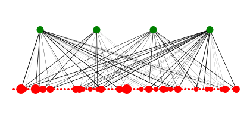

# `oxygraphis`

## Introduction

A small crate and command line tool to interact with ecological graphs. The only graph type currently implemented is the bipartite graph.



## CLI details

### Install

As this is all in development, currently you will need to clone this repository and build from source. Never fear, just download the rust toolchain. Then:

```bash
git clone https://github.com/Euphrasiologist/oxygraphis
cd oxygraphis
# install to path.
cargo install --path=.
```

### Interface

Currently only the `bipartite` module is implemented. There are no major plans to extend beyond this.

```bash
oxygraphis 0.1.2
Max Brown <euphrasiamax@gmail.com>

USAGE:
    oxygraphis [SUBCOMMAND]

OPTIONS:
    -h, --help       Print help information
    -V, --version    Print version information

SUBCOMMANDS:
    bipartite    Generate and analyse bipartite graphs.
    help         Print this message or the help of the given subcommand(s)
```

#### Bipartite graphs

Analysis of bipartite graphs can be done via `oxygraphis`.

```bash
oxygraphis-bipartite 
Generate and analyse bipartite graphs.

USAGE:
    oxygraphis bipartite [OPTIONS] <INPUT_DSV> [DELIMITER] [SUBCOMMAND]

ARGS:
    <INPUT_DSV>    An input DSV with three headers only: from, to, and weight.
    <DELIMITER>    Specify the delimiter of the DSV; we assume tabs.

OPTIONS:
    -b, --bivariatedistribution    Return the bivariate degree distribution of a bipartite graph.
    -d, --degreedistribution       Return the degree distribution of a bipartite graph.
    -h, --help                     Print help information
    -p, --plotbp                   Render an SVG bipartite graph plot.

SUBCOMMANDS:
    derived-graphs        Coerce a bipartite graph into two derived graphs.
    help                  Print this message or the help of the given subcommand(s)
    interaction-matrix    Coerce a bipartite graph into an interaction matrix.
    modularity            Derive the modularity of a bipartite graph.
    simulate              Simulate a number of graphs, and return calculations over the samples.
```

The input must be a delimited file with three columns only:

```txt
from    to    weight
Sp1    Sp2    1.0
Sp2    Sp3    1.0
Sp1    Sp3    1.0
```

And I guess should be bipartite in structure, though no internal checks are currenlty done on this.

#### Derived graphs

Derived graphs are graphs which show the relationships between species in a stratum.

```bash
oxygraphis-bipartite-derived-graphs 
Coerce a bipartite graph into two derived graphs.

USAGE:
    oxygraphis bipartite <INPUT_DSV> derived-graphs [OPTIONS]

OPTIONS:
    -h, --help                      Print help information
    -p, --plotdg                    Render an SVG derived graph of a stratum.
    -r, --remove [<REMOVE>...]      Edges with fewer than this number of connections are removed
                                    from the graph. [default: 2.0]
    -s, --stratum [<STRATUM>...]    The stratum to display. [default: host] [possible values: host,
                                    parasite]
```

#### Interaction matrix

These form the core of some interesting bipartite analyses. Essentially an n x m matrix of all possible species-species interactions in the network.

```bash
oxygraphis-bipartite-interaction-matrix 
Coerce a bipartite graph into an interaction matrix.

USAGE:
    oxygraphis bipartite <INPUT_DSV> interaction-matrix [OPTIONS]

OPTIONS:
    -h, --help      Print help information
    -n, --nodf      Compute the NODF number of a *sorted* interaction matrix.
    -p, --plotim    Render an SVG interaction matrix plot.
        --print     Print the inner matrix as a TSV. Mainly for debugging.
```

#### Modularity 

An algorithm operating on the interaction matrix made from a bipartite graph. It attempts to find modules of species-host interactions in a matrix.

```bash
oxygraphis-bipartite-modularity 
Derive the modularity of a bipartite graph.

USAGE:
    oxygraphis bipartite <INPUT_DSV> modularity [OPTIONS]

OPTIONS:
    -h, --help         Print help information
    -l, --lpawbplus    Compute the modularity of a bipartite network using LPAwb+ algorithm.
    -p, --plotmod      Plot the interaction matrix of a bipartite network, sorted to maximise
                       modularity.
```

#### Simulations

A subcommand to simulate a number of random graphs (Erdos-Renyi) and execute a calculation on each.

```bash
oxygraphis-bipartite-simulate 
Simulate a number of graphs, and return calculations over the samples.

USAGE:
    oxygraphis bipartite <INPUT_DSV> simulate [OPTIONS] --parasitenumber <PARASITENUMBER> --hostnumber <HOSTNUMBER> --edgecount <EDGECOUNT>

OPTIONS:
    -c, --calculation [<CALCULATION>...]
            The calculation to make. [default: nodf] [possible values: nodf, lpawbplus,
            degree-distribution, bivariate-distribution]

    -e, --edgecount <EDGECOUNT>
            Number of edges in the graph.

    -h, --help
            Print help information

        --hostnumber <HOSTNUMBER>
            Number of host nodes in the graph.

    -n, --nsims [<NSIMS>...]
            Number of random samples to make. [default: 1000]

        --parasitenumber <PARASITENUMBER>
            Number of parasite nodes in the graph.
```

More detailed docs to follow.

## Oxygraphis..?

*Oxygraphis* is one of only 5-6 genera in the flowering plants which have *graph* included fully in the name. It's in the Ranunculaceae.