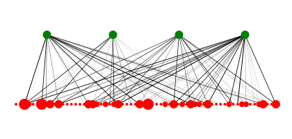

# `oxygraphis`

A lightweight command-line tool and Rust library for analysing bipartite ecological networks. Computes nestedness (NODF), specialisation (H2', d'), modularity (LPAwb+/DIRTLPAwb+), and derived graph structure from a simple edge-list input.



---

## Install

Requires the [Rust toolchain](https://rustup.rs).

```bash
# from crates.io
cargo install oxygraphis

# from source
git clone https://github.com/Euphrasiologist/oxygraphis
cd oxygraphis
cargo install --path=.
```

Pre-built binaries for major platforms are available on the [releases page](https://github.com/Euphrasiologist/oxygraphis/releases).

---

## Input format

All `bipartite` subcommands take a delimited file with exactly three named columns:

```
from    to      weight
Sp1     Host1   3.0
Sp1     Host2   1.0
Sp2     Host2   2.0
```

- **`from`** — parasite/row stratum (e.g. parasite species, pollinator species)
- **`to`** — host/column stratum (e.g. host plant, flower species)
- **`weight`** — interaction strength; any positive numeric value (integer or float)

The graph must be strictly bipartite: all edges go from one stratum to the other. The default delimiter is tab; use `-d ','` for CSV.

---

## Top-level commands

```
oxygraphis bipartite <INPUT_DSV> [OPTIONS] [SUBCOMMAND]
oxygraphis simulate   --parasitenumber N --hostnumber N --edgecount N [OPTIONS]
```

---

## `bipartite` — load and analyse a real network

### Arguments

| Argument | Description |
|----------|-------------|
| `<INPUT_DSV>` | Path to the edge-list file (required) |

### Options

| Flag | Description |
|------|-------------|
| `-d, --delimiter CHAR` | Column delimiter. Default: tab. Pass a single character, e.g. `-d ','` for CSV. |
| `-p, --plotbp` | Render an SVG bipartite graph (uniform node size) and print to stdout. |
| `-q, --plotbp2` | Render an SVG bipartite graph with node size proportional to degree. |
| `--degrees` | Print the degree of every node (number of unique interaction partners). Output: `spp`, `stratum`, `value`. |
| `-e, --degreedistribution` | Print the degree distribution for each stratum as a frequency table. Output: `stratum`, `degree`, `count`. |
| `-b, --bivariatedistribution` | Print the joint (parasite degree, host degree) distribution across all edges. |

### Subcommands

---

#### `interaction-matrix` — network metrics

Builds an *n* × *m* matrix (parasites × hosts) and computes metrics. With no metric flags, prints summary statistics only.

**Summary statistics output** (tab-separated):

| Column | Meaning |
|--------|---------|
| `weighted` | Whether any edge weight differs from 1 (true/false) |
| `#_rows` | Number of parasite species |
| `#_cols` | Number of host species |
| `#_poss_ints` | Total possible interactions (rows × cols) |
| `perc_ints` | Percentage of cells that are non-zero (matrix fill, %) |
| `link_density` | Mean number of host species per parasite species (= total interactions / parasites) |

**Flags:**

| Flag | Description |
|------|-------------|
| `--print` | Print the raw interaction matrix as a TSV (rows = parasites, cols = hosts). Useful for debugging. |
| `-p, --plotim` | Render an SVG heatmap of the interaction matrix. Cell colour intensity scales with edge weight. |
| `-n, --nodf` | Compute NODF (Nestedness metric based on Overlap and Decreasing Fill). The matrix is sorted by decreasing marginal totals before calculation. Score ranges 0–100; higher = more nested. |
| `-w, --weighted` | Use weighted NODF rather than binary. Requires `--nodf`. |
| `--wbinary` | Use weighted-binary NODF (binary filter applied to weighted matrix). Requires `--nodf`. |
| `-P, --permutations N` | Run a permutation significance test with *N* iterations against the r00 null model (random shuffle of all non-zero elements, preserving matrix dimensions and fill). Applies to `--nodf` or `--h2`. Outputs: observed value, null mean, null SD, one-tailed p-value, N. Recommended: 999 for exploration, 9999 for publication. |
| `-d, --dprime parasites\|hosts` | Compute d' (d-prime) for each species in the chosen stratum. d' measures how much a species deviates from using partners in proportion to their overall marginal frequency. 0 = complete generalist; 1 = complete specialist. Also prints `mean_d'` across the stratum. |
| `--h2` | Compute H2' (H2-prime), a network-level specialisation index. Scaled so that 0 = most generalised and 1 = most specialised network possible given the observed marginal totals. Works with both integer counts and continuous weights. Combine with `--permutations N` to test significance. |

**Example:**

```bash
# Summary stats + specialisation metrics
oxygraphis bipartite network.tsv interaction-matrix --nodf --weighted --h2 --dprime parasites --permutations 999

# Print sorted matrix as TSV
oxygraphis bipartite network.tsv interaction-matrix --print
```

---

#### `derived-graphs` — unipartite projections

Projects the bipartite graph into two unipartite derived graphs: one connecting parasites that share hosts, and one connecting hosts that share parasites. Edge weights are the number of shared partners.

Without flags, prints a summary row:

| Column | Meaning |
|--------|---------|
| `p_nodes` | Number of parasite nodes |
| `p_edges` | Number of parasite–parasite edges (unfiltered) |
| `p_edge_fil` | Parasite–parasite edges remaining after applying `--remove` threshold |
| `h_nodes` | Number of host nodes |
| `h_edges` | Number of host–host edges (unfiltered) |
| `h_edge_fil` | Host–host edges remaining after applying `--remove` threshold |

**Flags:**

| Flag | Description |
|------|-------------|
| `-v, --overlap` | Print pairwise Jaccard host-overlap between all parasite species. Jaccard = shared_hosts / union_hosts. Output columns: `sp1`, `sp2`, `jaccard`. Sorted by descending Jaccard. |
| `-p, --plotdg` | Render an SVG of the chosen stratum's derived graph. Requires `--stratum`. |
| `-s, --stratum host\|parasite` | Which stratum to plot or summarise. Default: `host`. |
| `-r, --remove N` | Remove derived-graph edges with weight below *N* before plotting/summarising. Default: 2.0. |
| `-d, --diameter N` | SVG plot width and height in pixels (square). Default: 600. |

**Example:**

```bash
# Pairwise host overlap between parasite species
oxygraphis bipartite network.tsv derived-graphs --overlap

# Plot the parasite derived graph, keeping only strongly overlapping pairs
oxygraphis bipartite network.tsv derived-graphs --stratum parasite --plotdg --remove 5 > parasite_overlap.svg
```

---

#### `modularity` — detect interaction modules

Finds groups of parasites and hosts that interact more with each other than with the rest of the network (modules) using label-propagation algorithms. Modularity Q ranges from 0 (no structure) to 1 (perfectly modular).

**Flags:**

| Flag | Description |
|------|-------------|
| `-l, --lpawbplus` | Compute Q using LPAwb+ (Beckett 2016). Fast; suitable for exploration. Mutually exclusive with `--dirtlpawbplus`. |
| `-d, --dirtlpawbplus` | Compute Q using DIRTLPAwb+ (Beckett 2016). Reruns LPAwb+ from multiple starting conditions to escape local optima. Recommended for final analyses. Mutually exclusive with `--lpawbplus`. |
| `--mini N` | DIRTLPAwb+ only: minimum number of modules from which label propagation is restarted. Default: 4, as in Beckett (2016) and the R package bipartite. |
| `--reps N` | DIRTLPAwb+ only: number of LPAwb+ restarts per module number, run in parallel. Default: 10, as in Beckett (2016) and bipartite. |
| `-p, --plotmod` | Write two files to the output directory: (1) an SVG interaction matrix sorted by module membership, and (2) a TSV of module assignments with columns `module`, `parasite`, `host`. |
| `-o, --output DIR` | Directory for output files when `--plotmod` is used. Default: current directory. Files are named `DIRTLPAwb+_modules.tsv` / `DIRTLPAwb+_interaction_matrix.tsv` (or `LPAwb+_…`). |

**Example:**

```bash
# Q value only
oxygraphis bipartite network.tsv modularity --dirtlpawbplus

# Q value + module assignments + sorted matrix plot
oxygraphis bipartite network.tsv modularity --dirtlpawbplus --plotmod --output ./results/
```

---

## `simulate` — random graph null distributions

Generates *N* random Erdős–Rényi bipartite graphs and computes a metric on each. Useful for building null distributions or understanding expected metric values under random wiring.

### Required arguments

| Flag | Description |
|------|-------------|
| `--parasitenumber N` | Number of parasite (row) nodes per simulated graph |
| `--hostnumber N` | Number of host (column) nodes per simulated graph |
| `-e, --edgecount N` | Number of edges per simulated graph. Must be ≤ parasitenumber × hostnumber. |

### Options

| Flag | Description |
|------|-------------|
| `-n, --nsims N` | Number of random graphs to generate. Default: 1000. |
| `--mini N`, `--reps N` | DIRTLPAwb+ search settings, as for `modularity`. Defaults: 4 and 10. |
| `-c, --calculation METRIC` | Metric to compute on each graph. Options: `nodf`, `lpawbplus`, `dirtlpawbplus`, `degree-distribution`, `bivariate-distribution`. Default: `nodf`. |
| `--plot` | Render an SVG of the first simulated graph and print to stdout. |

**Example:**

```bash
# Null NODF distribution for a 10×50 network with 100 edges
oxygraphis simulate --parasitenumber 10 --hostnumber 50 --edgecount 100 --nsims 999 --calculation nodf
```

---

## Metrics reference

### NODF — Nestedness metric based on Overlap and Decreasing Fill

A measure of whether species with fewer partners interact with a strict subset of the partners used by more-connected species. Higher values (closer to 100) indicate strong nestedness. The matrix is sorted by decreasing marginal totals before calculation. Three variants:

- **Binary NODF**: presence/absence only
- **Weighted NODF** (`--weighted`): accounts for interaction strengths
- **Weighted-binary NODF** (`--wbinary`): binary filter on the weighted matrix

Significance is assessed against the r00 null model via `--permutations N`.

### H2' — Network-level specialisation

Measures how much the whole network deviates from random partner use, scaled between the maximum-generalisation and maximum-specialisation networks possible given the observed marginal totals. Values near 0 mean partners are used roughly in proportion to their overall availability; values near 1 indicate strong, non-random specialisation across the whole network. Works with both integer and continuous weights.

### d' — Species-level specialisation

Measures how much an individual species deviates from using partners in proportion to their marginal frequency (background availability). A species with d' = 0 uses partners exactly proportional to their abundance; d' = 1 uses only a subset regardless of availability. Reported per species plus the stratum mean.

### Modularity Q (LPAwb+ / DIRTLPAwb+)

Barber's bipartite modularity, optimised by label propagation. Detects groups of parasites and hosts that preferentially interact with each other. Q = 0 indicates no modular structure; Q approaching 1 indicates strong modularity. DIRTLPAwb+ runs multiple restarts to avoid local optima and is preferred for final analyses.

### Jaccard host-overlap

For each pair of parasite species, Jaccard similarity = |shared hosts| / |union of hosts|. A value of 1 means the two species use exactly the same hosts; 0 means no overlap. Computed from the parasite derived graph via `derived-graphs --overlap`.

---

## Oxygraphis…?

*Oxygraphis* is one of only 5–6 genera in the flowering plants with *graph* embedded in the name. It sits in the Ranunculaceae, making it a distant relative of buttercups.
