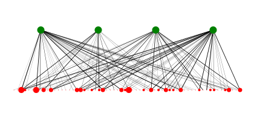

# `oxygraphis`

A small crate and command line tool to interact with ecological graphs. The only graph type currently implemented is the bipartite graph.

Algorithmic implementations to follow, but bipartite graphs can be visualised, as below.

*Oxygraphis* is one of only 5-6 genera in the flowering plants which have *graph* included fully in the name. It's in the Ranunculaceae.